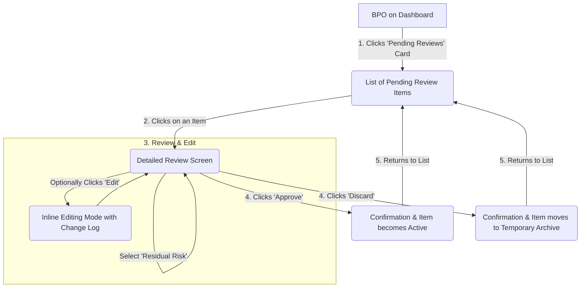

# ibe160 UX Design Specification

_Created on Saturday, November 29, 2025 by BIP_
_Generated using BMad Method - Create UX Design Workflow v1.0_

---

## Executive Summary

The vision for ibe160 is to create a GRC (Governance, Risk, and Compliance) platform that feels like an **empowering, efficient, and expert partner**. It moves beyond being a simple database to become an active assistant for compliance professionals.

The core "wow" experience is the proactive **AI Legal Specialist**, which analyzes complex regulatory documents and suggests relevant controls and processes before a human has even started reading. This defining interaction is designed to make the user feel in control, insightful, and significantly more productive.

Our design will be guided by the following principles, synthesized from best-in-class applications:
- **Clarity and Minimalism (Inspired by Apple):** The UI will be clean, professional, and uncluttered, using strong typography and ample whitespace to reduce cognitive load and keep the focus on the data.
- **Actionable, Data-Rich Dashboards (Inspired by Auditboard):** The dashboard will be the customizable heart of the application, providing real-time, role-specific insights with clear, drill-down capabilities.
- **Beautiful, Insightful Data (Inspired by Nordnet):** We will use effective data visualization to transform complex compliance data into clear, beautiful, and immediately understandable insights, without overwhelming the user.

The primary emotional goal is to make the user feel **empowered, in control, efficient, and productive**. The platform will be a desktop-first experience, ensuring a rich, data-centric interface.

---

## 1. Design System Foundation

### 1.1 Design System Choice

The foundational design system chosen for this project is **Shadcn/UI**.

This decision was based on its unique approach that balances pre-built component structure with deep customizability, aligning perfectly with the project's core UX principles.

### Rationale for Choosing Shadcn/UI

1.  **Alignment with UX Vision:** Shadcn/UI enables the creation of a clean, professional, and "data-first" interface, directly supporting the desired user feeling of being "empowered, in control, and productive." Its minimalist aesthetic is a perfect match for our "authoritative and minimalist" design goal.
2.  **Customizability and Ownership:** Unlike traditional component libraries, Shadcn/UI provides components as code that we copy into our project. This means we have full ownership and control, allowing us to tailor every detail to our specific needs without being locked into a vendor's styling or API.
3.  **Modern Tech Stack Integration:** It is built on modern standards, using Tailwind CSS for styling and Radix UI for accessible primitives. This integrates seamlessly with the project's specified tech stack (Next.js, TypeScript, Tailwind CSS).
4.  **Efficiency and Quality:** By providing a curated set of high-quality, accessible components, we accelerate development significantly while ensuring a consistent and robust user experience, avoiding the need to build foundational elements from scratch.

This choice provides the ideal foundation for building a unique, professional, and highly functional user interface that is both scalable and maintainable.

---

## 2. Core User Experience

### 2.1 Defining Experience

The defining experience of the ibe160 platform—the core "wow" moment that delivers its primary value—is the **proactive AI-powered gap analysis**.

This is the sequence where the user uploads a complex legal or regulatory document and, instead of facing a daunting manual review, is presented with a clear, actionable list of suggested controls and business processes generated by the AI Legal Specialist.

This interaction is the heart of the application and what separates it from a simple database. It's the moment the platform transforms from a passive tool for documentation into an **active, expert partner**. Getting this experience right is the highest priority, as it is the primary driver for making users feel empowered, in control, and efficient. All other features and design decisions are in service to making this core workflow as seamless, trustworthy, and insightful as possible.

### 2.2 Novel UX Patterns

To support the application's defining experience, a novel UX pattern named **"AI Review Mode"** has been designed. This pattern has been refined to incorporate a critical **two-stage approval workflow**, which separates initial AI triage from final business approval. This ensures both efficiency and accountability.

### Stage 1: Compliance Officer (CO) Triage

This stage is focused on speed and allowing a compliance expert to quickly filter the AI's raw output.

1.  **Trigger & Processing:** After a document is uploaded, the CO manually triggers the AI analysis. The UI provides transparent feedback during processing (e.g., "Analyzing Clauses," "Generating Controls").

2.  **Triage Interface:** The CO is presented with the two-panel "AI Review Mode":
    *   **Left Panel:** A list of all raw AI suggestions.
    *   **Right Panel:** Full details of the selected suggestion in an editable form.
    *   **Efficiency Actions:** To facilitate rapid review, "Accept All" and "Dismiss All" batch actions are available. Keyboard shortcuts (e.g., 'J'/'K' for navigation) will be implemented for power users.

3.  **CO Action ("Promote to Review"):** When a CO "Accepts" a suggestion, it is **not** made active. Instead, its status changes to **"Pending Review,"** and it is routed to the appropriate Business Process Owner's queue. A clear confirmation with an icon and text (e.g., "✅ Sent for BPO review") provides immediate feedback.

### Stage 2: Business Process Owner (BPO) Final Approval

This stage is focused on detailed review and accountability by the person who owns the process or control.

1.  **Trigger:** The BPO is notified via their dashboard of items in their "Pending Review" queue.

2.  **Approval Interface:** Clicking a pending item brings the BPO to a view similar to the Review Mode, but framed for final approval. It shows the full details of the item.

3.  **BPO Actions (Final Decision):** The BPO has three options:
    *   **Approve:** Formally accepts the item, changing its status to **"Active."** It now becomes part of the official, live risk and control matrix.
    *   **Edit:** The BPO can make any necessary modifications before approving.
    *   **Discard:** The item is rejected and removed from the workflow. This action is logged for audit purposes.

This two-stage pattern, inspired by the clarity of approval systems like Visma Approval, provides a robust and scalable workflow. It empowers the CO to act as an efficient gatekeeper, while ensuring the BPO retains ultimate authority and accountability.

### Data Persistence and Audit Trail

A critical principle of this pattern is ensuring a complete chain of evidence.

-   **Persistent Source Link:** The "source" link, which points to the specific clause in the source document that triggered the AI suggestion, is treated as permanent metadata.
-   **Workflow Visibility:** This source link is saved when the CO promotes the suggestion to "Pending Review." It is then clearly visible to the BPO during their final approval stage.
-   **Permanent Record:** Once approved by the BPO, the source link remains permanently attached to the active control or risk record. Any user viewing the item in the future will see the original evidence that led to its creation, ensuring full traceability.

---

## 3. Visual Foundation

### 3.1 Color System

The visual foundation of the application is built on a dual-theme color system, a clear typography hierarchy, and a consistent spacing model. These elements work together to create a professional, accessible, and data-first user experience.

### 1. Color System

The application will support both a Light (default) and a Dark (user-selectable) theme to accommodate user preference and reduce eye strain in data-heavy environments.

#### Light Mode (Default): "Clarity Green"
This theme is designed to feel clean, calm, and positive, using green as the primary indicator for success and progress.

-   **Primary:** `#28a745` (A strong, accessible green for primary actions)
-   **Secondary:** `#17a2b8` (A complementary teal for secondary actions or information)
-   **Semantic Colors:**
    -   Success: `#28a745` (Green)
    -   Warning: `#ffc107` (Yellow)
    -   Error: `#dc3545` (Red)
-   **Neutrals:** A scale of grays will be used for text, backgrounds, and borders to ensure content is legible and the interface is clean.

#### Dark Mode: "Focused Slate"
This theme is modern, sophisticated, and ideal for focusing on data visualizations and reducing eye strain.

-   **Primary:** `#0A84FF` (A vibrant blue that stands out on a dark background)
-   **Secondary:** `#5E5CE6` (A complementary purple for secondary elements)
-   **Semantic Colors:**
    -   Success: `#30D158` (A bright green)
    -   Warning: `#FFD60A` (A vivid yellow)
    -   Error: `#FF453A` (A clear red)
-   **Neutrals:** A scale of dark grays and slate tones will be used for text, backgrounds (`#1C1C1E`), and surfaces (`#2C2C2E`) to create a sense of depth and focus.

### 2. Typography

The typography system is designed for maximum readability and a clear information hierarchy.

-   **Font Families:**
    -   **Body & Headings:** A system font stack (`-apple-system, BlinkMacSystemFont, "Segoe UI", Roboto, "Helvetica Neue", Arial, sans-serif`) will be used for its high legibility and native performance.
    -   **Monospace:** A standard monospace stack (`"SFMono-Regular", Consolas, "Liberation Mono", Menlo, monospace`) will be used for code snippets or tabular data where alignment is critical.
-   **Type Scale:** A clear and consistent scale (e.g., H1: 36px, H2: 28px, H3: 24px, Body: 16px, Small: 14px) will be used to establish a strong visual hierarchy.
-   **Font Weights:**
    -   **Headings:** Bold (600 or 700)
    -   **Body:** Normal (400)
    -   **Labels/Emphasis:** Medium (500) or Semi-bold (600)

### 3. Spacing & Layout

A consistent spacing system will be used to create a visually rhythmic and organized layout.

-   **Base Unit:** **8px**. All spacing values (padding, margins, gaps) will be multiples of 8px.
-   **Scale:** A defined scale (e.g., `spacing-1`=8px, `spacing-2`=16px, `spacing-3`=24px) will be used by developers to ensure consistency and eliminate arbitrary values. This creates a predictable and professional visual structure.

**Interactive Visualizations:**

- Color Theme Explorer: [ux-color-themes.html](./ux-color-themes.html)

---

## 4. Design Direction

### 4.1 Chosen Design Approach

After a thorough review of three distinct visual concepts, a final hybrid design direction was chosen. This approach combines the strongest elements of **"Direction 1: The Focused Dashboard"** and **"Direction 3: The Action-Oriented Hub"** to create an interface that is both professional and highly efficient.

### The Hybrid Design Approach

The chosen design provides a scalable structure with a modern, task-focused user experience.

1.  **Primary Layout & Navigation (from Direction 1):** The application will use a professional layout featuring a **collapsible left-hand sidebar** for main navigation. This provides a consistent and predictable structure that can easily scale as more features are added. The ability to collapse the sidebar gives users the flexibility to maximize their content area, which is crucial for reviewing dense data.

2.  **Dashboard Experience (from Direction 3):** The main dashboard will be designed as an **"Action-Oriented Hub."** Instead of a static report, the dashboard will feature a grid of modular cards representing the user's most immediate tasks and priorities (e.g., "Pending Reviews," "High-Priority Risks"). This makes the entry point of the application highly engaging and functional.

3.  **Core Action Placement (from Direction 3):** A prominent **"Analyze New Document" button** will be placed on the main dashboard. This elevates the application's most critical feature, making it immediately accessible and reinforcing its importance in the user's workflow.

4.  **Data Display (from Direction 1):** When drilling down from the dashboard into specific data sets (e.g., viewing a full list of risks), the UI will use clean, structured **data tables**. This approach is ideal for presenting dense, sortable information in a clear and professional manner.

5.  **AI Review Mode (from Direction 1):** The two-panel layout for the AI Review Mode is confirmed and will be a cornerstone of the design, providing a focused environment for reviewing AI suggestions.

### Rationale

This hybrid direction was chosen because it successfully marries the robust, scalable navigation of a traditional professional application with a modern, modular, and task-focused dashboard. It provides the structure needed for a complex GRC tool while ensuring the user experience is direct, intuitive, and efficient.

**Interactive Mockups:**

- Design Direction Showcase: [ux-design-directions.html](./ux-design-directions.html)

---

## 5. User Journey Flows

### 5.1 Critical User Paths

### Journey 1: AI-Powered Gap Analysis

This is the core workflow of the application, detailing how a Compliance Officer (CO) processes a new regulatory document and routes AI-generated suggestions to the appropriate Business Process Owners (BPOs) for final approval. The journey follows a deliberate "Send & Notify" model.

**Actor:** Compliance Officer (CO)
**Goal:** To analyze a new document, triage AI suggestions, and formally send them to BPOs for review.

#### Step-by-Step Flow:

1.  **Initiate Analysis:** From the main dashboard, the CO clicks the prominent **"Analyze New Document"** button.
2.  **Upload Document:** The CO is presented with an upload interface and selects a regulatory document (e.g., PDF, TXT) from their local machine.
3.  **AI Processing:** The system shows clear feedback that the AI is working, displaying the current stage of analysis (e.g., "Analyzing Clauses," "Generating Controls").
4.  **Triage in "AI Review Mode":** Upon completion, the CO enters the two-panel "AI Review Mode." They efficiently review the list of suggestions, using **"Accept"** to keep promising suggestions or **"Dismiss"** to discard irrelevant ones. Batch actions ("Accept All") are available for high-confidence results.
5.  **Finish Triage:** Once the CO has reviewed all suggestions, they click a **"Finish Review"** button.
6.  **Summary & Assignment View:** The CO is taken to a summary screen. This screen lists all the suggestions they "Accepted," automatically grouped by the suggested BPO who will be assigned the review.
7.  **Send for Review:** After a final look, the CO clicks the definitive **"Send for Review"** button.
8.  **Handoff & Notification:** The system officially routes the items to the respective BPOs' "Pending Review" queues and sends out notifications (e.g., email, in-app) to alert them of their new tasks.

#### Journey Visualization (Mermaid Diagram):

### Journey 2: Control Assessment Journey (for BPOs)

This journey details the Business Process Owner's (BPO) workflow for reviewing and acting upon AI-generated suggestions promoted by a Compliance Officer (CO). It emphasizes the BPO's final accountability in integrating new controls or risks into the system.

**Actor:** Business Process Owner (BPO)
**Goal:** To efficiently review, approve, edit, or discard AI-suggested controls/risks, ensuring they are accurately aligned with business processes, and making final decisions.

#### Step-by-Step Flow:

1.  **Access Pending Reviews:** From their main dashboard, the BPO clicks on the "Pending Reviews" card (part of the Action-Oriented Hub), which leads them to a dedicated list of items awaiting their final decision.
2.  **Initial Overview & Business Process Centricity:** The list prominently displays the **suggested Business Process**, along with the associated Risk and Control name/summary. This immediate visibility of the business process is crucial for the BPO to quickly determine relevance and identify if existing documentation already covers the suggestion.
3.  **Detailed Review View:** The BPO clicks on an item from the list to open a detailed, dedicated review screen. This screen is structured to provide all necessary context for a decision:
    *   **Comprehensive Details:** All AI-suggested information for the Business Process, Risk, and Control is displayed in an editable form, including descriptions, proposed owners, and relevant metadata.
    *   **Persistent Source Link:** The `source_reference` link, originally from the AI's analysis, is clearly visible and accessible for immediate verification.
    *   **Residual Risk Categorization:** A prominent dropdown menu allows the BPO to categorize the **Residual Risk** associated with the control as "low," "medium," or "high." This is a mandatory step for final approval.
    *   **Integrated AI Chat:** The AI chat icon remains visible on the right, providing an option for conversational queries or modifications.
4.  **Action Buttons:** "Approve," "Edit," and "Discard" buttons are clearly positioned on the screen, reflecting the BPO's authority.
5.  **"Edit" Experience:** If the BPO clicks "Edit," the form fields become directly editable (inline editing). A readily accessible **"Change Log" window** is available, documenting all modifications made to the item (who, what, when), thereby ensuring an auditable history of changes.
6.  **"Approve" Action:**
    *   If the BPO clicks "Approve," the item is formally accepted into the system.
    *   **Feedback:** The system displays "✅ Successfully added to register" and provides a direct link to view the newly active item within the core system.
    *   The item's status changes from "Pending Review" to **"Active."**
7.  **"Discard" Action:**
    *   If the BPO clicks "Discard," the item is rejected from the active workflow.
    *   **Feedback:** The system displays "🗑️ Item disregarded."
    *   The item is moved to a **"Temporary Archive"** (or a "bin folder") where it remains for a defined period (e.g., 30-90 days) before permanent deletion. This allows for recovery or re-evaluation if needed.
8.  **Return to List:** After taking action on an item, the BPO automatically returns to their list of "Pending Reviews."

#### Journey Visualization (Mermaid Diagram):

---

## 6. Component Library

### 6.1 Component Strategy

The component library strategy balances the efficiency of using a robust design system with the necessity of developing custom components for unique functionalities, especially for the core AI interactions.

#### Standard Components (Leveraging Shadcn/UI)

The majority of standard UI elements will be built using **Shadcn/UI**, providing a consistent, accessible, and performant foundation. This includes:

*   **Buttons:** For all primary, secondary, destructive, and tertiary actions.
*   **Form Elements:** Inputs, textareas, select dropdowns (e.g., for Residual Risk categorization), radio buttons, and checkboxes.
*   **Data Display:** Highly configurable data tables for displaying lists of risks, controls, and other core entities. Cards for dashboard metrics and action items.
*   **Navigation:** Collapsible sidebar navigation.
*   **Feedback:** Toast notifications for success/error messages, alerts, spinners, and progress bars.
*   **Overlays:** Modals for confirmations, complex forms, and detailed views.
*   **Tooltips/Popovers:** For contextual help and interactive elements like the AI chat icon.

#### Custom Components & Heavy Customizations

Specific functionalities require bespoke components or heavy customization of standard components to meet the unique UX requirements:

1.  **AI Chat Interface:** The conversational AI assistant within the "AI Review Mode."
2.  **Change Log Window:** A dedicated interface to display historical modifications and audit trails, integrated seamlessly with inline editing capabilities.
3.  **Document Upload & AI Processing Feedback:** A custom UI to manage file uploads, display progress feedback during AI analysis, and potentially preview documents.
4.  **Dashboard Action Cards:** While built on a standard card component, the specific content, metrics, embedded actions, and dynamic nature of these cards will be custom to the "Action-Oriented Hub" design.

---

### Custom Component Focus: The AI Chat Interface

The **AI Chat Interface** is a critical, novel component designed to function as a professional legal helper, seamlessly integrated into the "AI Review Mode." Its purpose is to clarify AI suggestions, facilitate data modification through conversational prompts, and provide additional context or information.

*   **Purpose:** To provide professional, conversational assistance for reviewing and refining AI-generated suggestions within the "AI Review Mode." It acts as a legal expert that the user can query or instruct to make changes to the suggested data.
*   **Anatomy:**
    *   **Chat Input:** A text input field for the user to type questions or instructions.
    *   **Chat History:** A scrollable area displaying conversational turns (user queries, AI responses).
    *   **Action Buttons (within chat):** Buttons within AI responses to apply suggested changes directly to the editable form fields.
    *   **Contextual Icon:** An always-visible icon (e.g., speech bubble, AI icon) that, when clicked, reveals/hides the chat interface within the review screen.
*   **Initial Prompt:** The AI will initiate interaction with a professional, open-ended question like: "What can I help you with regarding this suggestion?"
*   **User Actions:** Users can type questions, give instructions for modifications, or accept AI-generated suggestions directly into the form fields.
*   **States:** The component will clearly communicate its current state:
    *   **Waiting for Input:** Standard chat input field.
    *   **AI Typing/Thinking:** Visual indicators (e.g., ellipsis, brief loading spinner within the chat) to show the AI is processing or generating a response.
    *   **Error State:** Clear, concise error messages if the AI cannot fulfill a request or encounters an issue.
*   **Variants:** A single, consistent, versatile design will be used across the application. The interface will adapt its content and functionality contextually based on the user's query and the current AI suggestion being reviewed.

---

## 7. UX Pattern Decisions

### 7.1 Consistency Rules

To ensure a predictable, intuitive, and professional user experience, the following UX patterns will be applied consistently across the entire application.

*   **1. Button Hierarchy:**
    *   **Primary Action (e.g., "Approve," "Save"):** A solid button using the primary theme color (`Clarity Green`) to draw the most attention for the main action on a page.
    *   **Secondary Action (e.g., "Cancel," "Edit"):** A subtle button with a thin border and transparent background to offer an alternative, less-emphasized action.
    *   **Destructive Action (e.g., "Discard," "Delete"):** A secondary-style button that reveals a red color on hover. This clearly communicates a dangerous action while preventing visual clutter and accidental clicks.

*   **2. Feedback & Loading Patterns:**
    *   **Success/Info Feedback (e.g., "Item saved"):** A non-intrusive "toast" notification will appear briefly at the bottom of the screen and then automatically dismiss. This informs the user without interrupting their workflow.
    *   **Critical Error Feedback:** A modal dialog will be used for critical errors that require the user's full attention and acknowledgement. The user must actively dismiss this dialog to continue.
    *   **Loading States:** For page-level loading or table filtering, a subtle progress bar at the top of the screen will be used. For individual components loading content (like a dashboard card), a "skeleton" placeholder will be used to show the shape of the impending content, reducing perceived wait time.

*   **3. Form Patterns:**
    *   **Labels:** Form labels will always be positioned **above** their corresponding input field for maximum clarity and accessibility.
    *   **Validation:** Input fields will be validated as the user moves out of the field (`onBlur`). This provides immediate feedback without being disruptive during typing.
    *   **Error Display:** A simple, concise error message will appear in red text directly below the field that has an error.

*   **4. Modal (Popup) Patterns:**
    *   **Behavior:** Modals will be used for critical confirmations or focused tasks that require interrupting the user's workflow. They can be dismissed by clicking a "Cancel" or "Close" button, pressing the `Escape` key, or clicking on the shaded background overlay.

*   **5. Empty State Patterns:**
    *   **Purpose:** To provide guidance when a view has no data to display.
    *   **Design:** An empty state will consist of a relevant icon, a helpful and encouraging message, and, where appropriate, a primary action button to guide the user on what to do next (e.g., "You have no pending reviews. Great job!" or "No risks found. Get started by analyzing a document.").

*   **6. Confirmation Patterns:**
    *   **Destructive Actions:** A confirmation modal will **always** be used before a permanent, destructive action (e.g., "Are you sure you want to permanently delete this control? This action cannot be undone.").
    *   **Reversible Actions:** For less critical, reversible actions (e.g., moving an item to the "Temporary Archive"), a toast notification with an "Undo" button will be used. This is faster for the user but still provides an escape hatch.

---

## 8. Responsive Design & Accessibility

### 8.1 Responsive Strategy

This section defines the application's strategy for handling different screen sizes and ensuring usability for people with disabilities.

### Responsive Strategy: Desktop-First

The application is explicitly designed with a **desktop-first** approach. The primary goal is to deliver a rich, powerful, and data-dense user experience optimized for larger screens (laptops and desktop monitors).

*   **MVP Focus:** For the Minimum Viable Product, development and design efforts will be concentrated on perfecting the experience on screen widths of 1024px and wider.
*   **Smaller Screens:** While the application will not be fully optimized for tablet or mobile devices in the MVP, the layout will be built using responsive principles to prevent "breaking." It will remain usable on smaller screens, but without a custom-tailored mobile UX.

This focused strategy ensures that the core experience for the primary user on their main device is of the highest quality.

### Accessibility (A11y) Strategy: WCAG 2.1 Level AA

The application will be developed to meet the standards of the **Web Content Accessibility Guidelines (WCAG) 2.1 at Level AA**. This is the globally recognized standard for professional and enterprise-grade web applications, ensuring the product is inclusive and meets the procurement requirements of most large organizations.

Key requirements for achieving AA compliance include:

*   **Color Contrast:** All text and critical UI elements will meet the minimum contrast ratio of 4.5:1 to be easily readable. This will be a primary consideration for both the "Clarity Green" (Light) and "Focused Slate" (Dark) themes.
*   **Keyboard Navigation:** All interactive elements—including buttons, links, form fields, and navigation—will be fully operable using only a keyboard.
*   **Focus Indicators:** A clear and visible focus state will be present on all interactive elements, allowing keyboard users to easily identify where they are on the page.
*   **Screen Reader Support:** Proper semantic HTML and ARIA (Accessible Rich Internet Applications) labels will be used to ensure the application is understandable and navigable by users with screen readers. This includes providing alternative text for all meaningful images and icons.
*   **Form Labels:** All form inputs will be explicitly linked to their corresponding labels, a critical requirement for accessibility.

---

## 9. Implementation Guidance

### 9.1 Completion Summary

This UX Design Specification is complete. Through a collaborative process, we have defined a comprehensive blueprint for the application's user experience. All placeholders have been filled, and all major design decisions have been made and documented.

### What we created together:

*   **A Clear Vision:** We established that the application should feel like an "empowering, efficient, and expert partner," with the proactive AI Legal Specialist as its core "wow" experience.
*   **Design System:** We confirmed **Shadcn/UI** as our foundational system, providing a balance of consistency and customizability.
*   **Visual Foundation:** We defined a dual-theme color system with **"Clarity Green" (Light Mode)** and **"Focused Slate" (Dark Mode)**, along with a robust typography and spacing system.
*   **Design Direction:** We created a unique **hybrid design direction**, combining a collapsible sidebar with a modular, action-oriented dashboard to offer a professional and efficient user experience.
*   **Critical User Journeys:** We mapped out the two most critical workflows: the "AI-Powered Gap Analysis" for Compliance Officers and the "Control Assessment Journey" for Business Process Owners.
*   **Component & Pattern Strategy:** We identified necessary standard and custom components (like the AI Chat Interface) and established a complete set of UX consistency rules.
*   **Responsive & Accessibility Strategy:** We confirmed a **desktop-first** approach for the MVP and committed to meeting the **WCAG 2.1 Level AA** accessibility standard.

### Your Deliverables:

*   **UX Design Specification:** This document (`docs/ux-design-specification.md`) serves as the complete and final record of all UX decisions.
*   **Interactive Color Themes:** `docs/ux-color-themes.html`
*   **Design Direction Mockups:** `docs/ux-design-directions.html`

This specification provides a solid foundation for designers to create high-fidelity mockups and for developers to begin implementation with clear UX guidance and rationale.

---

## Appendix

### Related Documents

- Proposal: proposal.md
- Product Requirements: docs/PRD.md
- Product Brief: docs/product-brief-ibe160-2025-11-17.md
- Brainstorming: docs/brainstorming-session 1-results-Saturday, November 8, 2025.md
             docs/brainstorming-session 2-results-Saturday, November 8, 2025.md

### Core Interactive Deliverables

This UX Design Specification was created through visual collaboration:

- **Color Theme Visualizer**: docs/ux-color-themes.html
  - Interactive HTML showing all color theme options explored
  - Live UI component examples in each theme
  - Side-by-side comparison and semantic color usage

- **Design Direction Mockups**: docs/ux-design-directions.html
  - Interactive HTML with 6-8 complete design approaches
  - Full-screen mockups of key screens
  - Design philosophy and rationale for each direction

### Optional Enhancement Deliverables

_This section will be populated if additional UX artifacts are generated through follow-up workflows._

<!-- Additional deliverables added here by other workflows -->

### Next Steps & Follow-Up Workflows

This UX Design Specification can serve as input to:

- **Wireframe Generation Workflow** - Create detailed wireframes from user flows
- **Figma Design Workflow** - Generate Figma files via MCP integration
- **Interactive Prototype Workflow** - Build clickable HTML prototypes
- **Component Showcase Workflow** - Create interactive component library
- **AI Frontend Prompt Workflow** - Generate prompts for v0, Lovable, Bolt, etc.
- **Solution Architecture Workflow** - Define technical architecture with UX context

### Version History

| Date     | Version | Changes                         | Author        |
| -------- | ------- | ------------------------------- | ------------- |
| Saturday, November 29, 2025 | 1.0     | Initial UX Design Specification | BIP |

---

_This UX Design Specification was created through collaborative design facilitation, not template generation. All decisions were made with user input and are documented with rationale._
